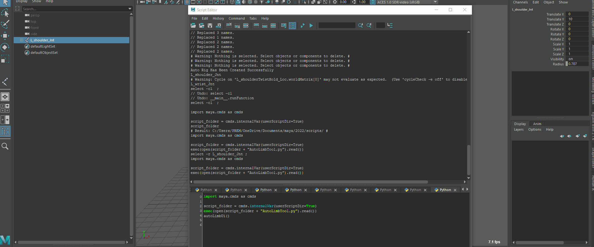

# BipedLimbCreator 🦿

**BipedLimbCreator** is an Auto Limb Tool for Autodesk Maya that allows artists and riggers to effortlessly create biped limbs with advanced functionality. It supports IK/FK switching, stretch, and twist features out-of-the-box.

## 🔧 Features

- ✅ Auto-creation of Biped Arm or Leg rigs
- 🔁 IK/FK switch setup
- 📏 Stretch functionality for dynamic posing
- 🔄 Twist joints for smooth deformation
- ⚙️ Clean hierarchy and naming conventions
- 🚀 Fast and production-ready

## 🖼 Screenshot and Demo



## 🖥️ Requirements

- Autodesk Maya (Tested on 2022 and above)
- Python 2.7 or 3.x (depending on Maya version)
- Maya `cmds` modules

## 📂 Installation
```Python
import maya.cmds as cmds

script_folder = cmds.internalVar(userScriptDir=True)
exec(open(script_folder + "CopySkinWeights_Tool.py").read())
```

1. Clone or download the repository:
   ```bash
   git clone https://github.com/yourusername/BipedLimbCreator.git
   ```
